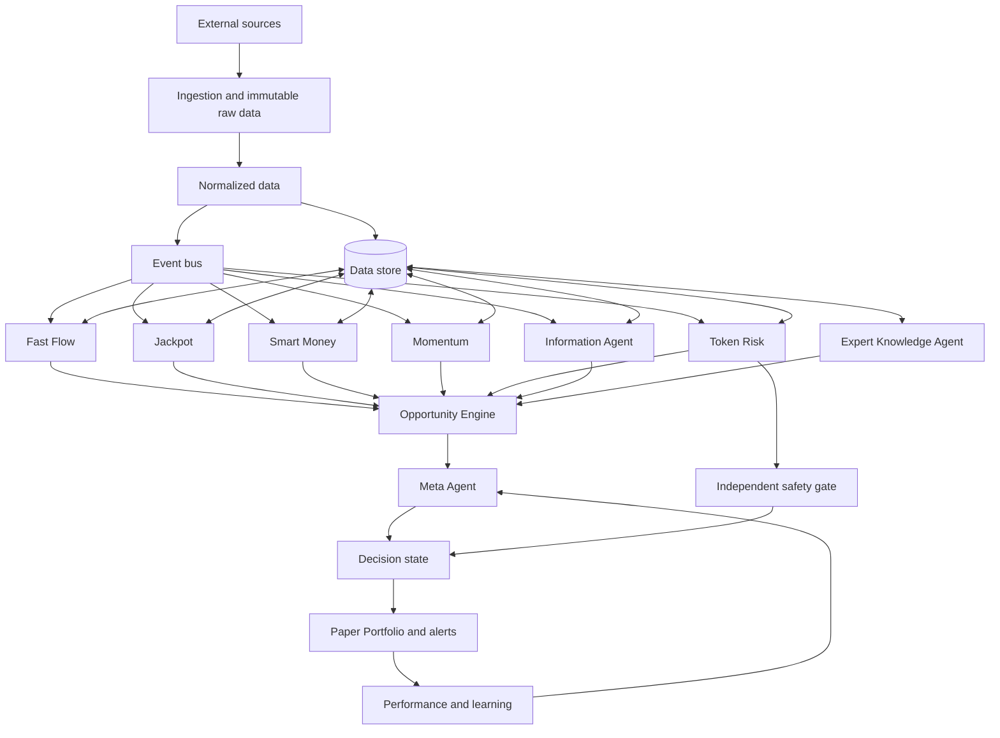

# Master Architecture v1.0

Status: **LOCKED**  
Scope: single-user research, paper trading, simulation, and historical replay. Live trading execution remains out of scope.

This document defines the target architecture. New features may extend it, but must not silently change the boundaries below.

## Core principle

An agent is a versioned capability with a clear input, output, evidence trail, and performance history. It is not synonymous with an LLM.

- Deterministic agents handle facts, calculations, safety rules, state transitions, and scoring inputs.
- Retrieval and rules agents organize structured knowledge and evidence.
- LLM-assisted agents may interpret unstructured information, critique, summarize, or propose hypotheses.
- No LLM may invent evidence, rewrite market data, bypass risk controls, promote its own strategy, or execute a trade.

## System flow

The Information Agent is not a gateway between data and other agents. Every authorized agent can subscribe to relevant events and query the data store directly. The Meta Agent sits after specialist analysis and never blocks access to facts.

For the current local, single-user phase, the event bus should start as a PostgreSQL outbox plus idempotent workers. A transport interface must allow Redis Streams, NATS, or Kafka later without changing agent contracts.

## Agent responsibilities

### Information Agent — “What do we know?”

Organizes facts, source identity, freshness, asset identity, conflicts, and data quality. It does not decide whether to invest.

### Expert Knowledge Agent — “How should this be understood?”

Provides structured and versioned investment principles to specialists. Knowledge is retrieved by topic rather than injected as one large prompt.

Knowledge domains include fundamentals, market structure, risk management, behavioral finance, and crypto/tokenomics. Each item must carry source, version, effective timestamp, and availability timestamp.

It may produce review findings such as missing volume confirmation or weak cash-flow quality. Any numeric confidence adjustment must be performed by a deterministic, versioned policy—not improvised by an LLM.

Knowledge has two layers:

1. Global knowledge: sourced accounting logic, market mechanics, validated research, and risk principles.
2. Learned knowledge: patterns found by this system, admitted only after out-of-sample validation and replay checks.

### Specialist agents

Examples are Smart Money, Momentum, Fundamental, News Catalyst, Mean Reversion, Options, Social, and Jackpot. Each produces a bounded opinion with evidence references, horizon, confidence, data quality, and model/rule version.

### Fast Flow

Fast Flow is an independent low-latency path. It uses deterministic convergence rules and synchronous hard safety checks before creating a fast opportunity. It never waits for slow enrichment.

An opportunity gains immutable revisions as evidence arrives:

- `v0`: wallet/event convergence and hard safety result
- `v1`: Smart Money and wallet independence
- `v2`: Token Risk and liquidity
- `v3`: social, news, and information enrichment
- `v4`: Meta assessment and paper-trade eligibility

Earlier decisions remain reproducible from the evidence available at that time.

### Jackpot Agent

Scores two independent dimensions: probability and potential payoff. Jackpot exposure has a separate capped risk budget and may never consume Core portfolio risk or increase risk to recover previous losses.

### Independent Risk Agent

Evaluates liquidity, authorities, concentration, manipulation, correlation, drawdown, position size, and tail risk. It may veto an opportunity. Every veto must store evidence, rule version, and timestamp.

### Meta Agent — “What do we do with the specialist opinions?”

Combines versioned specialist outputs using measured out-of-sample performance by market regime. Initially this is a deterministic policy and weighting engine. An LLM may explain the result, but cannot silently change weights or thresholds.

Meta does not need to find one permanently best strategy. Its job is to determine which validated strategies deserve weight in the current regime.

### Performance and evolution

Every signal and decision must be measured against later outcomes. Proposed strategy changes flow through historical replay, simulation, out-of-sample validation, paper trading, and human approval. Agents may propose experiments but may not deploy themselves.

## Required contracts

Every event must include at least:

- stable event ID and schema version
- entity/asset identity
- `occurred_at`, `observed_at`, and `available_at`
- provider and source reference
- data quality/confidence
- immutable payload or payload hash

Every agent output must include at least:

- agent name and version
- opportunity/entity ID
- evidence references
- score dimensions and confidence
- data quality and missing-data reasons
- intended horizon and market regime, when applicable
- observed/effective/available timestamps

Unknown data remains `UNKNOWN`/`null`; agents must not convert missing evidence into neutral or positive evidence.

## Decision states

The Opportunity Engine owns explicit transitions:

`detected -> fast_opportunity -> enriching -> qualified | watch | rejected -> paper_trade_candidate`

Live execution is not part of v1. A future `live_candidate` state would still require separate user authorization and execution infrastructure.

## OpenAI boundary

The system works without OpenAI for ingestion, normalization, wallet verification, liquidity/risk evidence, Fast Flow, deterministic scoring, alerts, paper portfolios, simulation, replay, and performance measurement.

An OpenAI provider can later improve:

- extraction and synthesis of unstructured news and filings
- natural-language expert review
- conflict summaries and explanations
- research hypotheses and experiment proposals

LLM output is always advisory evidence with provenance. It cannot become the source of record for prices, transactions, liquidity, returns, accounting, or safety checks.

## Product surfaces

- Market Radar
- Fast Flow
- Jackpot Radar
- Smart Money
- Stocks
- Information Feed
- Agent Center
- Meta Control
- Paper Portfolio
- Simulation Lab
- Historical Replay
- Strategy Lab
- Performance

## Delivery order from the current system

The current repository already has provider adapters, ingestion jobs, normalized storage, point-in-time evidence, wallet verification, historical expansion, and data-quality tracking.

The next architectural layer is:

1. Versioned event envelope and PostgreSQL outbox.
2. Opportunity aggregate and immutable opportunity revisions.
3. Fast Flow convergence plus hard safety gate.
4. Paper Portfolio and outcome measurement.
5. Structured Expert Knowledge retrieval and review contracts.
6. Regime-aware Meta weighting based on measured performance.
7. Optional LLM provider adapters behind advisory-only interfaces.

## Invariants

- Point-in-time truth and replayability outrank attractive scores.
- Agents access data directly through authorized contracts.
- Information Agent and Meta Agent have different responsibilities.
- Fast Flow never waits for slow AI analysis.
- Safety checks and portfolio limits are deterministic.
- Missing evidence remains unknown.
- Every score, veto, revision, and decision is reproducible.
- No automatic trading execution in this architecture version.
